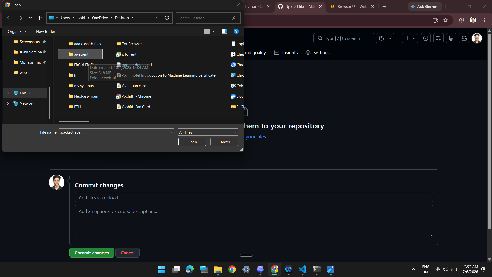
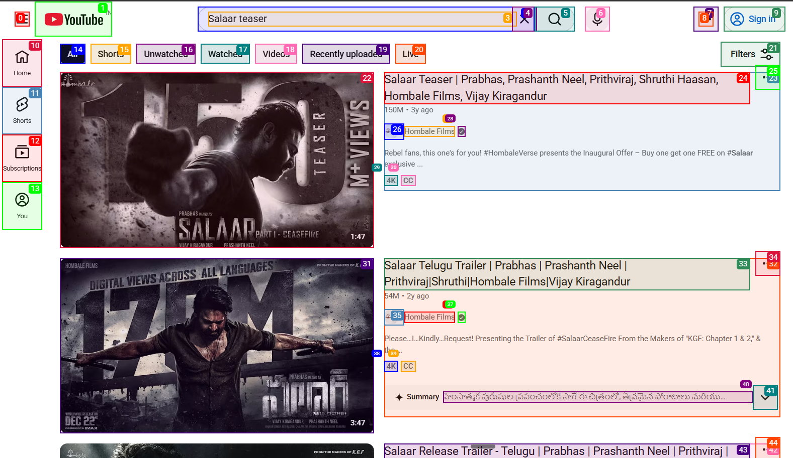
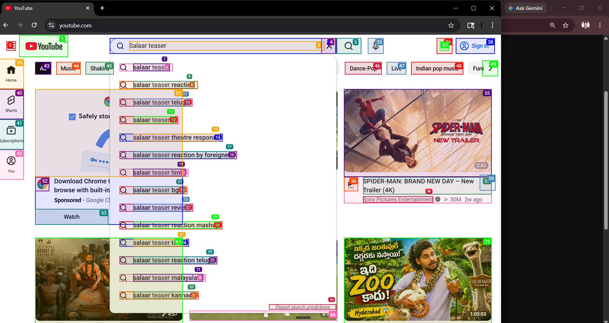
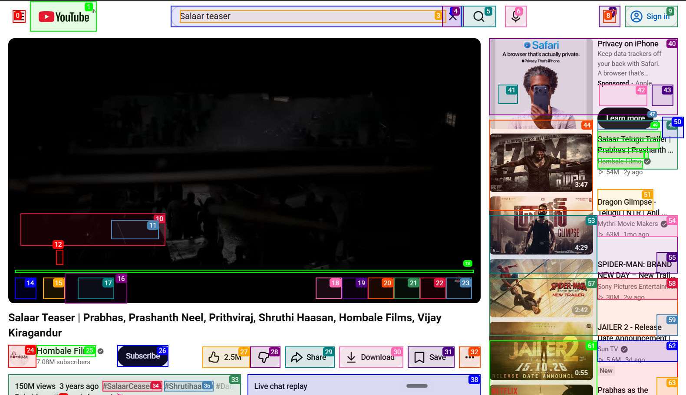

# AI Browser Agent Web UI


A Gradio-based browser automation interface built on top of `browser-use`.

This project lets you:
- choose an LLM provider from the UI
- enter a natural-language browser task
- run an AI browser agent step by step
- watch progress in the interface
- save agent history and task recordings

## Overview

This project combines four main layers:

- `Gradio` for the user interface
- `LangChain` for multi-provider LLM integration
- `browser-use` for AI browser-agent reasoning and action orchestration
- `Playwright` for real browser automation

In simple terms:

1. The user opens the UI.
2. The user selects an LLM and enters a task.
3. The app creates an agent.
4. `browser-use` turns the prompt into browser actions.
5. Playwright executes those actions in the browser.
6. The UI shows progress, screenshots, history, and final output.

## Features

- Gradio UI for browser automation tasks
- Support for multiple LLM providers
- Browser task execution using natural-language prompts
- Persistent browser session support
- Agent step history and GIF recording
- Deep Research workflow for multi-step research tasks
- Config load/save support
- Groq support added for OpenAI-compatible hosted inference

## Supported Providers

The project supports or is prepared to support providers such as:

- OpenAI
- Azure OpenAI
- Anthropic
- Google
- DeepSeek
- Groq
- Ollama
- Alibaba
- Moonshot
- IBM
- Mistral

Provider/model options are configured in [src/utils/config.py](./src/utils/config.py), and provider client setup lives in [src/utils/llm_provider.py](./src/utils/llm_provider.py).

## Screenshots

### Model Selection

Shows the UI where the user selects the model provider and agent configuration.



### Agent Understanding the Page

Shows the browser-use element overlays while the agent identifies page elements and decides the next action.



### Agent Search in Progress

Shows the agent searching inside YouTube and interpreting interactive suggestions and results.



### Agent Playing the Video

Shows the agent successfully opening and playing the selected YouTube video.



## Project Structure

```text
web-ui/
+-- assets/
+-- src/
¦   +-- agent/
¦   +-- browser/
¦   +-- controller/
¦   +-- utils/
¦   +-- webui/
+-- tests/
+-- .env.example
+-- requirements.txt
+-- webui.py
```

Important files:

- [webui.py](./webui.py): application entry point
- [src/webui/interface.py](./src/webui/interface.py): builds the Gradio interface
- [src/webui/webui_manager.py](./src/webui/webui_manager.py): shared UI and runtime state
- [src/webui/components/browser_use_agent_tab.py](./src/webui/components/browser_use_agent_tab.py): main browser agent workflow
- [src/agent/deep_research/deep_research_agent.py](./src/agent/deep_research/deep_research_agent.py): deep research workflow
- [src/utils/llm_provider.py](./src/utils/llm_provider.py): LLM provider integration

## Local Setup

### 1. Clone the project

```bash
git clone <your-repo-url>
cd web-ui
```

### 2. Create and activate a virtual environment

Windows PowerShell:

```powershell
python -m venv .venv
.\.venv\Scripts\Activate.ps1
```

Windows Command Prompt:

```cmd
python -m venv .venv
.venv\Scripts\activate.bat
```

### 3. Install dependencies

```bash
pip install -r requirements.txt
```

### 4. Install Playwright browsers

```bash
playwright install
```

### 5. Create your environment file

```bash
copy .env.example .env
```

Then add the provider key you want to use.

Example for Groq:

```env
GROQ_API_KEY=your_key_here
GROQ_ENDPOINT=https://api.groq.com/openai/v1
DEFAULT_LLM=groq
```

### 6. Run the app

```bash
python webui.py --ip 127.0.0.1 --port 7788
```

Open:

[http://127.0.0.1:7788](http://127.0.0.1:7788)

## Usage

1. Start the app.
2. Open the UI in your browser.
3. Select an LLM provider and model.
4. Enter a task such as:
   `Open YouTube and play a song`
5. Click `Submit Task`.
6. Watch the browser agent perform the task.

## Deep Research Mode

The project also includes a Deep Research workflow that:

- creates a research plan
- runs browser-based search tasks
- stores intermediate results
- writes a final markdown report

This flow is implemented in [src/agent/deep_research/deep_research_agent.py](./src/agent/deep_research/deep_research_agent.py).

## Notes

- Do not commit your real `.env` file to GitHub.
- Rotate any API key that has been exposed publicly.
- If you forked from another repository, make sure your `git remote` points to your own GitHub repo before pushing.

## Uploading This Project To GitHub

Before uploading, make sure:

- your `.env` file is not committed
- your API keys are safe
- your screenshots are inside the repository, for example in `assets/`

### Step 1. Check git status

```bash
git status
```

### Step 2. Make sure `.env` is ignored

Check that `.env` is listed in `.gitignore`.

If needed, add it there.

### Step 3. Create a new GitHub repository

Go to:

[https://github.com/new](https://github.com/new)

Create a new repository, for example:

- `ai-browser-agent-webui`

Do not initialize it with another README if you are pushing this existing project.

### Step 4. Change the remote to your GitHub repo

Your current `origin` points to the upstream project, so update it:

```bash
git remote remove origin
git remote add origin https://github.com/<your-username>/<your-repo-name>.git
```

You can verify with:

```bash
git remote -v
```

### Step 5. Add files

```bash
git add .
```

### Step 6. Commit

```bash
git commit -m "Initial commit"
```

### Step 7. Push

```bash
git branch -M main
git push -u origin main
```

## Recommended Final Check Before Push

Run these before uploading:

```bash
git status
python -m compileall src webui.py
```

Then confirm:

- no secrets are staged
- the README looks correct
- screenshots are present
- the app runs locally

## Tech Stack

- Python
- Gradio
- LangChain
- browser-use
- Playwright
- dotenv

## License

Use the license that matches your intended GitHub publication. If you are building on top of another repository, review its original license first.
